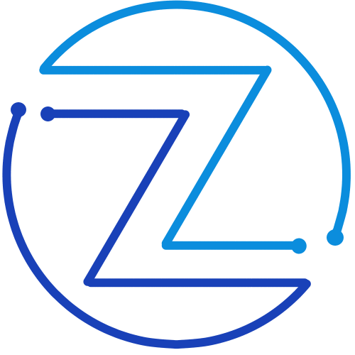

    
    <h1>
        <a href="https://www.zar-soft.com">www.zar-soft.com</a>
    </h1>
    <h4>
    <b>New website for the Zarsoft startup</b></h4>
    <h4>
        <a href="#project-structure">Project structure</a>
        •
        <a href="#built-with">Built with</a>
        •
        <a href="#deployment">Deployment</a>
        •
        <a href="#contact">Contact</a>
    </h4>
    <h3>
        
        
        <!--  -->
        
    </h3>

Zarsoft is a startup dedicated to the creation of personalized software with the idea of ​​creating any type of project from web applications, mobile applications, desktop applications, etc., that helps facilitate daily processes with the help of modern technologies.

<!-- ## Table of contents
* [Project structure](#project-structure)
* [Built with](#built-with)
  * [Backend](#backend)
  * [Frontend](#frontend) -->
  
## Project Structure
The project is divided into two parts backend and frontend.
The frontend shows us the page with zarsoft information, what services it offers, how it works, the technologies they use and a registration form where you can send contact information about a project you want to develop.
The backend is responsible for receiving the information from the form and storing it in a database, for this it has different APIs for data registration and query, in addition to having a connection to an autonomous Oracle Cloud database (Autonomous Databases).

## Built with

<!-- 

  

 -->

    <h3>
        
        
        
        
        
        
        
    </h3>

The project was created using Angular for the frontend with the following versions
Angular CLI: 16.2.1
Node: 18.17.1
Package Manager: npm 9.6.7

Java with maven and spring boot for the backend with the following versions
Apache Maven 3.9.6
Java version: 17.0.9

## Deployment

<!-- 

  

  -->

    <h3>
        
        
    </h3>

To install the project, docker and docker compose were used. Currently both the backend and frontend are installed on an AWS EC2 instance, while the database is in OCI.

In order to deploy the project, Dockerfiles and docker-compose.yml files were used. The dockerfiles are used to generate independent images of the frontend and backend, while the docker-compose.yml allowed us to add some other containers (nginx-proxy, letsencrypt-nginx-proxy-companion) in order to have a server to host the forntend and a companion that installs and updates SSL certificates automatically on our website

## Contact

  
  &nbsp;
  
  &nbsp;
  
  <!-- &nbsp;
   -->
  
  

 